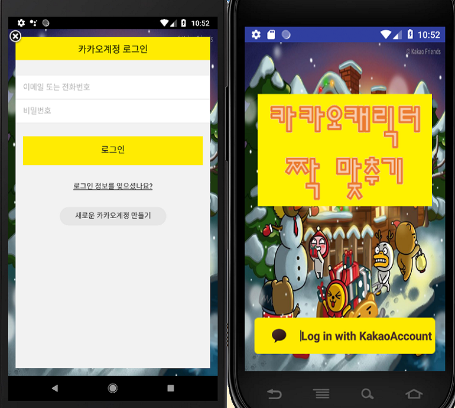
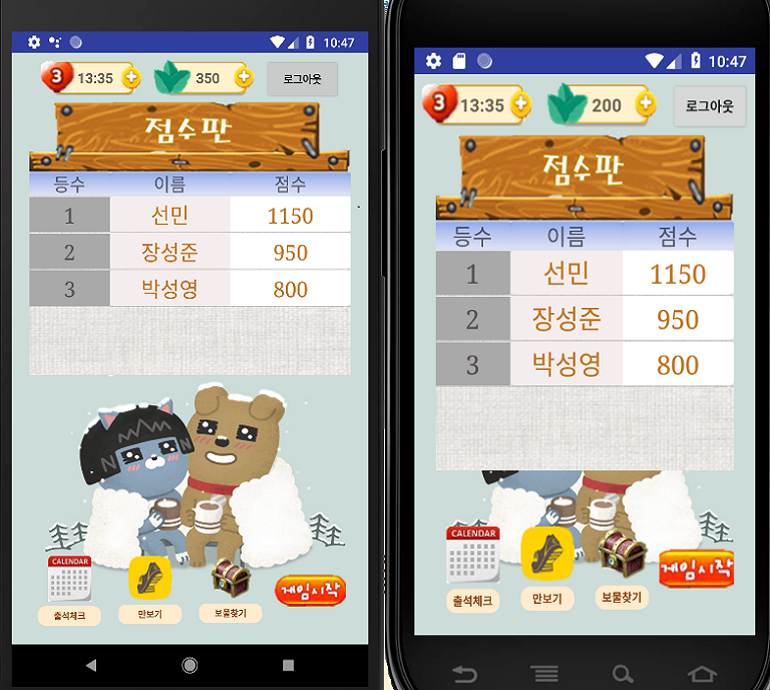
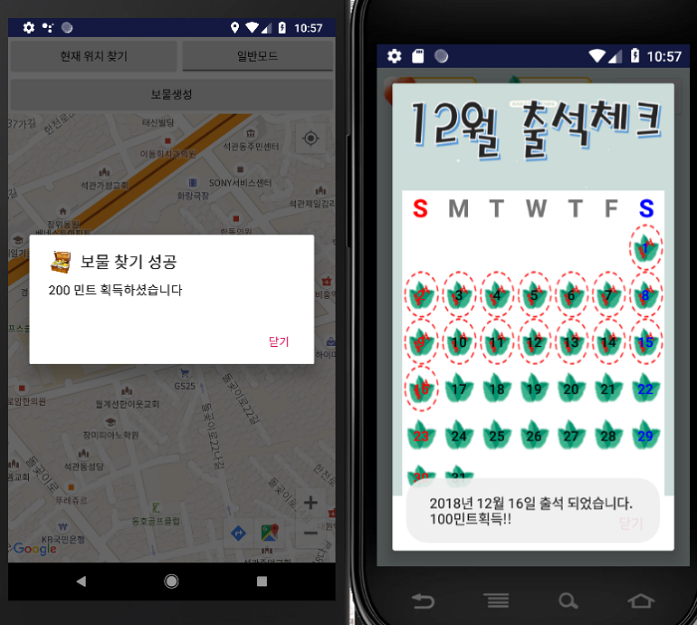

# Kakao_Card_Game_Android
## 카카오 캐릭터를 이용한 카드 짝맞추기 게임 (Andoird / Firebase / Kakao api / Google api) by 김선민, 장성준

### 1. 게임기능   
- (0) 안드로이드 환경의 파이어베이스를 연동한 카드 짝맞추기 게임
- (1) (Firebase Database) 게임 내 대전기능 (Socket 통신 x)
- (2) (Firebase Database) 대전 중 아이템 사용 가능
- (3) (Firebase Database) 1대1 및 추가 인원 접속시 자동 방 생성 기능
- (4) (Firebase Database) 게임 종료 후 점수 및 랭킹 반영   

### 2. 게임 외 기능
- (1) 카카오 로그인 API 연동한 카카오톡 ID로 로그인하기 기능
- (2) Google Map API를 이용한 보물찾기 기능 - 실시간 위치 찾기
- (3) 날짜 체크를 통한 출석체크 기능

### 3. 게임화면
- ### (1) 게임소개

- ### (2) 카카오톡 로그인

- ### (3) 메인 화면

- ### (4) 출석체크 기능 화면

- ### (5) 보물찾기 기능 화면

- ### (6) 카드게임 화면

- ### (7) 카드게임 종료 화면

### 4. 시연 동영상
- https://www.youtube.com/watch?v=J2PPYiU459A"

